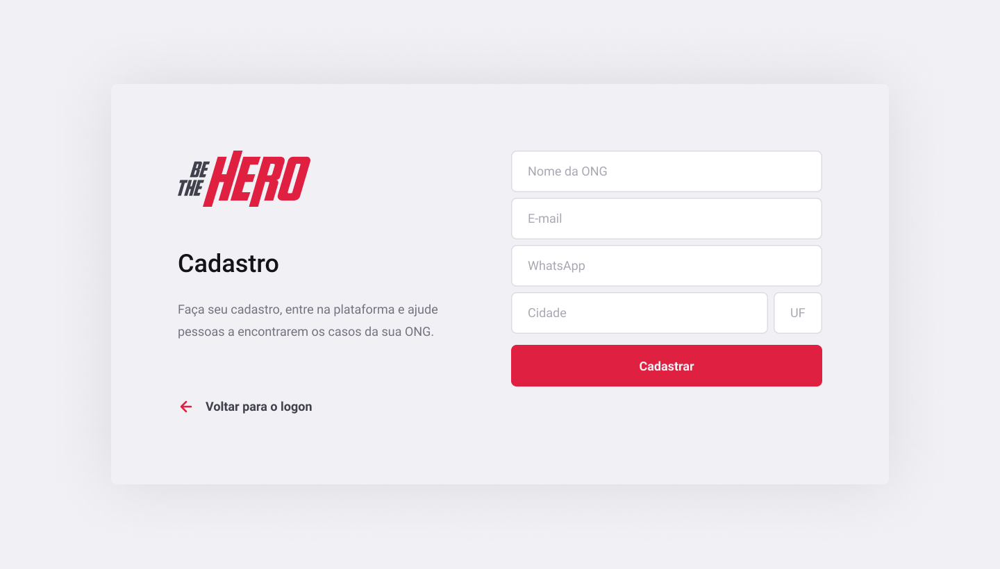
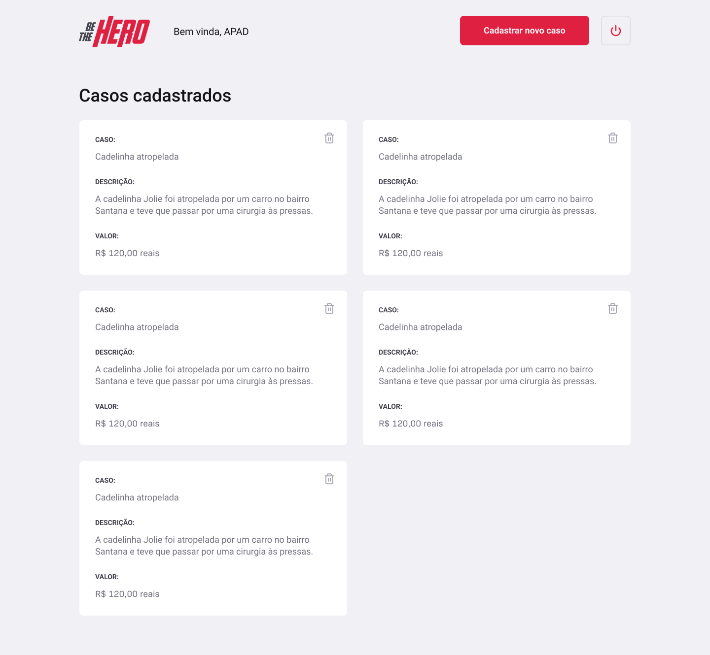
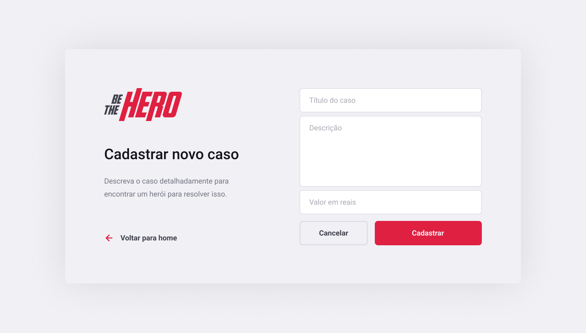
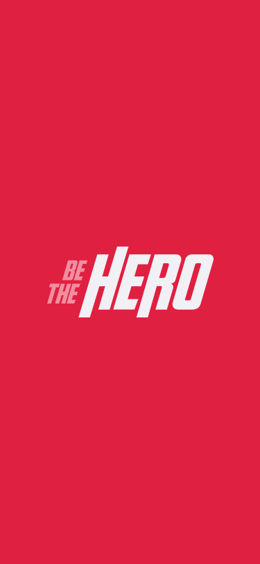
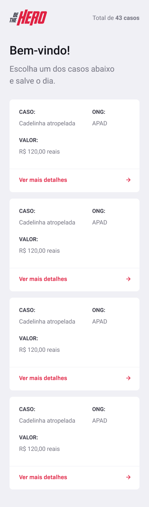
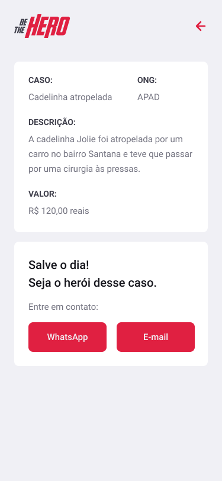

<h1 align="center">
    
</h1>

<h4 align="center">
  🚀 OmniStack Week 11.0
</h4>

<p align="center">
  <a href="#-technologies">Technologies</a>&nbsp;&nbsp;&nbsp;|&nbsp;&nbsp;&nbsp;
  <a href="#-overview">Overview</a>&nbsp;&nbsp;&nbsp;|&nbsp;&nbsp;&nbsp;
  <a href="#-getting-started">Getting started</a>&nbsp;&nbsp;&nbsp;|&nbsp;&nbsp;&nbsp;
  <a href="#-contributing">Contributing</a>&nbsp;&nbsp;&nbsp;|&nbsp;&nbsp;&nbsp;
  <a href="#memo-license">License</a>
</p>

<div align="center">
    
<space><space>
[](https://coveralls.io/github/monteiro-alexandre/be-the-hero?branch=master)
[](https://opensource.org/licenses/MIT)
[](http://makeapullrequest.com)

</div>

<br>

<p align="center">
  
</p>

<br>

<p align="center">
  
</p>

<br>

<p align="center">
  
</p>

<br>

<p align="center">
  
</p>

<br>

<p align="center">
  
</p>

<br>

<p align="center">
  
</p>

<br>

<p align="center">
  
</p>

## :rocket: Technologies

This project was developed with the following technologies:

- [Typescript](https://www.typescriptlang.org/)
- [Node.js](https://nodejs.org/en/)
- [React](https://reactjs.org)
- [React Native](https://facebook.github.io/react-native/)
- [Expo](https://expo.io/)
- [Lerna](https://lerna.js.org/)
- [Eslint](https://eslint.org/)
- [Commitlint](https://commitlint.js.org/#/)
- [Knex.Js](http://knexjs.org/)


## 💻 Overview

BeTheHero is a project that aims to connect people who wish to make monetary contributions to NGOs (non-governmental organizations) that need help.

## 📝 Getting started

First you need to have `node` and `yarn` installed on your machine. Then, you can clone this repository.

```bash
git clone https://github.com/monteiro-alexandre/be-the-hero.git
```
Install dependencies:

```bash
yarn
```

Packages dependencies:

```bash
yarn bootstrap
```

## Backend setup

Enter in folder packages/backend and Configure environment variables:
<br>
(create .env file based on .env.example)

```bash
# Port that the server is running, example: 3333
SERVER_PORT=3333 
```

Run database migrations:

```bash
yarn migrate:latest
```

Start server:

```bash
yarn start
```

## Frontend setup

Enter in folder packages/frontend and Configure environment variables:
<br>
(create .env file based on .env.example)

```bash
# backend url
REACT_APP_API_BASE_URL=http://your_machine_ip_address:3333
```

Start aplication:

```bash
yarn start
```

## Mobile setup

Enter in folder packages/mobile and Configure environment variables:
<br>
(create environment.ts file based on environment.example.ts)

```js
import Constants from 'expo-constants';

const ENV = {
	development: {
		apiUrl: 'http://your_machine_ip_address:3333/',
	},
	staging: {
		apiUrl: '',
	},
	production: {
		apiUrl: '',
	},
};

const getEnvVars = (env = Constants.manifest.releaseChannel): any => {
	let environment;
	// What is __DEV__ ?
	// This variable is set to true when react-native is running in Dev mode.
	// __DEV__ is true when run locally, but false when published.
	// eslint-disable-next-line
	if (__DEV__) {
		environment = ENV.development;
	} if (env === 'staging') {
		environment = ENV.staging;
	} if (env === 'production') {
		environment = ENV.production;
	}
	return environment;
};

export default getEnvVars;
```

Start Expo DevTools:

```bash
yarn start
```

Than you can open the app in your cell phone using the Expo client app for IOS and Android, see:

<a href="https://docs.expo.io/get-started/installation/#2-expo-client-app-for-ios-and">Expo Documentation</a>

## 🤔 Contributing

Please read [CONTRIBUTING.md](.github/CONTRIBUTING.md) for details on the code of conduct and the process for submitting pull requests.

## :memo: License

This project is under the MIT license. See the archive [LICENSE](LICENSE.md) for more details.
